# Facebook SKD for Android 📱

## Zakaj? 🤔

[Facebook SDK for andoird](https://developers.facebook.com/docs/android) je nabor knjižnic, ki jih ponuja Meta oz. Facebook, za itegracijo z jihovo Facebook/Messenger/Instagram aplikacijo, ter uporabniškim APIjom. Facebook SDK deluje z vsemi verzijami androida od verzije API-ja 14 dalje.
Knjižnica ponuja mnogo vrst interakcij z aplikacijami Meta skupine, med drugim deljenje videjev, objav, povezav, fotorgrafij in storijev na facebook. Objavljanje fotografij, ter sporočil na Messenger in objava reelsev na Instagram.
Omogoča tudi pridobivanje podatkov do prijavljenega uporabnika preko njihove SSO funkcionalnosti.
Ima tudi storitev za oglaševanje, ter sledenja prenosov naše aplikacije

## Prednosti ✅

- Možnost uporabe Facebook SSO v naši aplikaciji
- Preprosto deljenje slik, povezav, videjev iz lastne aplikacije na Facebook, Messenger ali Instagram.
- Vgrajene komponente za upravljanja prijave in deljenja,
- Enostavna integracija z obstoječo aplikacijo
- Aktivno maintainan

## Slabosti ❌

- Odvisni smo od Mete,
- Z integracijo Facebook SDKja lahko Meta zbira podatke o uporabnikih ki uporabljajo našo aplikacijo,
- Zastarela dokumentacija,
- Ni jasno kateri način uporabljat,
- Za produkcijsko objavo applikacije je potrebno imeti registriran poslovni račun pri Meti

## Licenca 📜

[© Meta Platforms, Inc. and affiliates](https://github.com/facebook/facebook-android-sdk/blob/main/LICENSE.txt)

Facebook SDK je zastoj. Funkcionalnosti kot so deljenje, dostop do graph API-ja, SSO so zastojn, vendar ima tudi plačljive storitve, kot je npr. storeitev za oglaševanje aplikacije.

## Število zvezdic, sledilcev, forkov


## Vzdrževanje projekta 🛠️

Projekt je bil nazadnje posodobljen pred 2 tednoma


## Primeri uporabe

### Ustvaritev aplikacije na Facebook

<div style="display: flex; gap: 1rem; flex-flow: column">
    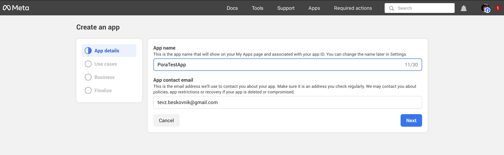
    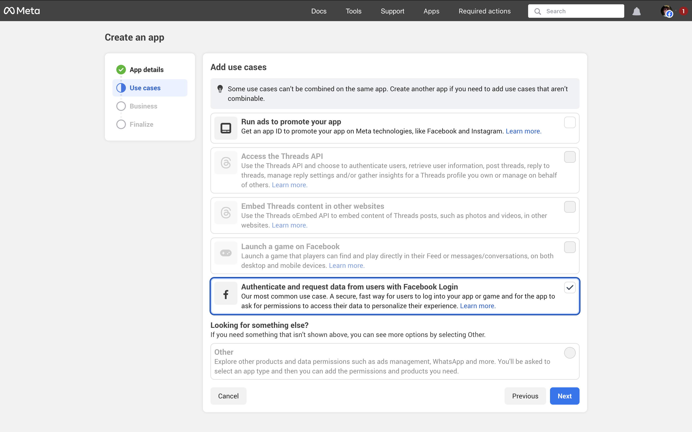
    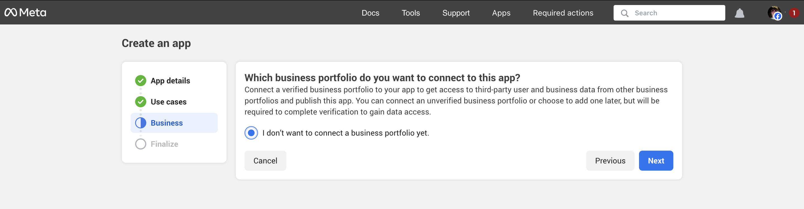
    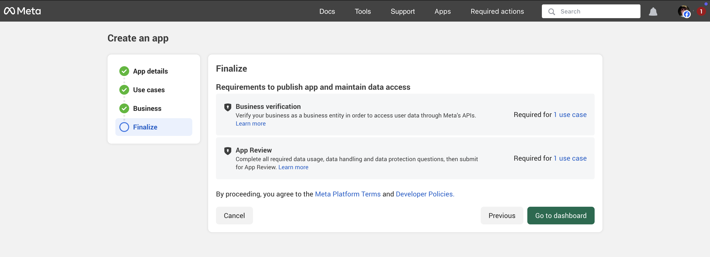
    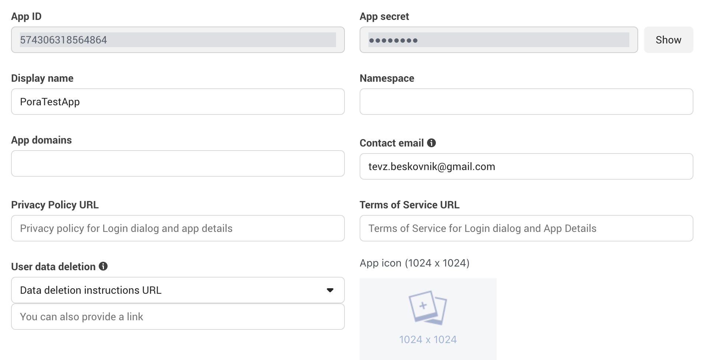
</div>

### Dodajanje ključev v projekt

Strings.xml:

```xml
<!-- Nadomesti {APP_ID} in {APP_SECRET} z vrednostmi v Facebook developer protalu-->
<resources>
    <string name="facebook_app_id" translatable="false">{APP_ID}</string>
    <string name="facebook_client_token" translatable="false">{APP_SECRET}</string>
</resources>
```

Manifest.xml:

```xml
<uses-permission android:name="android.permission.INTERNET" />
<queries>
    <provider android:authorities="com.facebook.katana.provider.PlatformProvider" />
    <provider android:authorities="com.facebook.orca.provider.PlatformProvider" />
    <package android:name="com.facebook.katana" />
</queries>
<!-- in <application> -->
<meta-data android:name="com.facebook.sdk.ApplicationId" android:value="@string/facebook_app_id"/>
<meta-data android:name="com.facebook.sdk.ClientToken" android:value="@string/facebook_client_token"/>
<provider android:authorities="com.facebook.app.FacebookContentProvider{APP_ID}"
    android:name="com.facebook.FacebookContentProvider"
    android:exported="true"/>
<activity tools:replace="android:theme"
    android:name="com.facebook.FacebookActivity"
    android:configChanges="keyboard|keyboardHidden|screenLayout|screenSize|orientation"
    android:theme="@android:style/Theme.Translucent.NoTitleBar"/>
```

---

### Sign in

```xml
<!-- Login button -->
<com.facebook.login.widget.LoginButton
        android:id="@+id/loginButton"
        android:layout_width="wrap_content"
        android:layout_height="wrap_content"/>
```

```kt
var userAccessToken: AccessToken
binding.loginButton.setPermissions("email", "public_profike")
binding.loginButton.registerCallback(demoApp.callbackManager, object : FacebookCallback<LoginResult> {
    override fun onSuccess(result: LoginResult) {
        Log.i("LoginButtonCallback", "Succesfully loggedin")
        userAccessToken = result.accessToken
    }

    override fun onCancel() {
        Log.i("LoginButtonCallback", "User canceled login")
    }

    override fun onError(error: FacebookException) {
        Log.e("LoginButtonCallback", "error: ${error.toString()}")
    }
})

// preverjanje stanja logina ob ponovnem odprtju aktivnosti
LoginManager.getInstance().retrieveLoginStatus(this, object : LoginStatusCallback {
    override fun onCompleted(accessToken: AccessToken) {
        userAccessToken = accessToken
        Log.i("RetrieveLogin", "Got access token")
    }

    override fun onFailure() {
        Log.i("RetrieveLogin", "Failed to fetch access token")
    }

    override fun onError(exception: Exception) {
        Log.e("RetrieveLogin", "Error: ${exception.toString()}")
    }
})
```

<div style="display: flex; gap: 1rem; flex-flow: column;">
    <div style="display: flex; gap: 1rem;">
        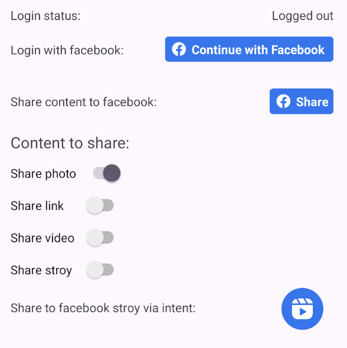
        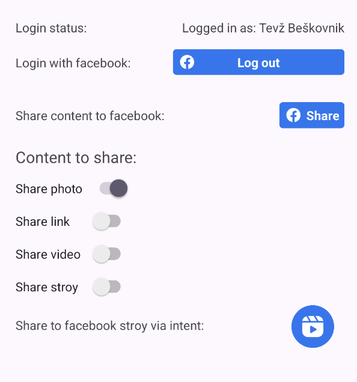
    </div>
    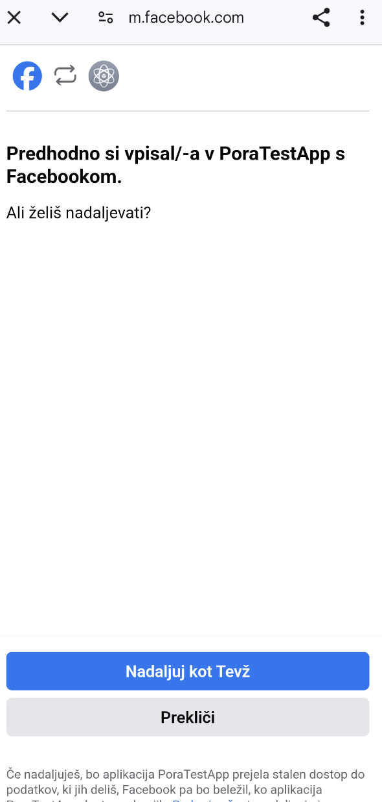
</div>

---

### Deljenje

```xml
<!-- Facebookov share gumb -->
<com.facebook.share.widget.ShareButton
        android:id="@+id/fbShareButton"
        android:layout_width="wrap_content"
        android:layout_height="wrap_content"/>
```

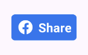

#### Deljenje povezave

```kt
val content: ShareLinkContent = ShareLinkContent.Builder()
    .setContentUrl(Uri.parse("https://example.com"))
    .setQuote("Tole je pa kr kul stvarca")
    .build()

binding.fbShareButton.shareContent = content
```

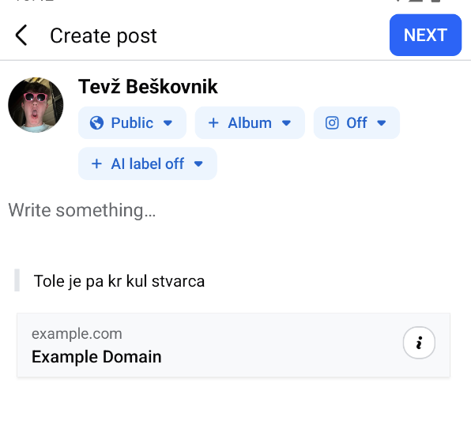

#### Deljenje slike

```kt
val bitmap: Bitmap = resources.getDrawable(R.drawable.rafting).toBitmap()

val photo: SharePhoto = SharePhoto.Builder()
    .setCaption("${demoApp.userName} has gone rafting!")
    .setBitmap(bitmap)
    .build()

val content: SharePhotoContent = SharePhotoContent.Builder()
    .addPhoto(photo)
    .build()

binding.fbShareButton.shareContent = content
```

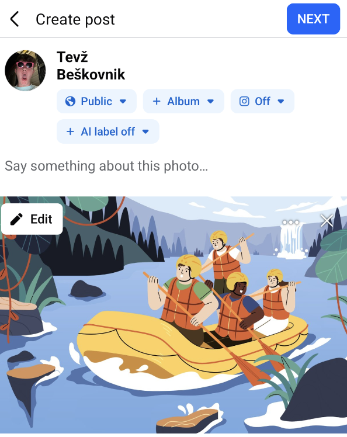

#### Deljenje videja

```kt
val videoFileUri = getVideoUriFromRawResource(R.raw.milk, resources, getExternalFilesDir(DIRECTORY_MOVIES)!!)

val video: ShareVideo = ShareVideo.Builder()
    .setLocalUrl(videoFileUri)
    .build()

val content: ShareVideoContent = ShareVideoContent.Builder()
    .setVideo(video)
    .setContentTitle("A tub of white liquid.")
    .build()

binding.fbShareButton.shareContent = content
```

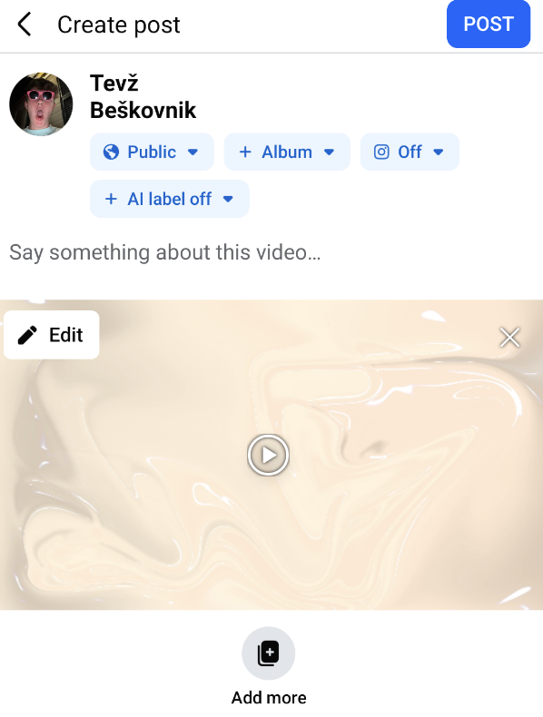

#### Deljenje na story

```kt
val videoFileUri = getVideoUriFromRawResource(R.raw.milk, resources, getExternalFilesDir(DIRECTORY_MOVIES)!!)

val bitmap: Bitmap = resources.getDrawable(R.drawable.rafting).toBitmap()

val video: ShareVideo = ShareVideo.Builder()
    .setLocalUrl(videoFileUri)
    .build()

val photo: SharePhoto = SharePhoto.Builder()
    .setCaption("${demoApp.userName} has gone rafting!")
    .setBitmap(bitmap)
    .build()

val content: ShareStoryContent = ShareStoryContent.Builder()
    .setBackgroundAsset(video)
    .setStickerAsset(photo)
    .build()

binding.fbShareButton.shareContent = content
```

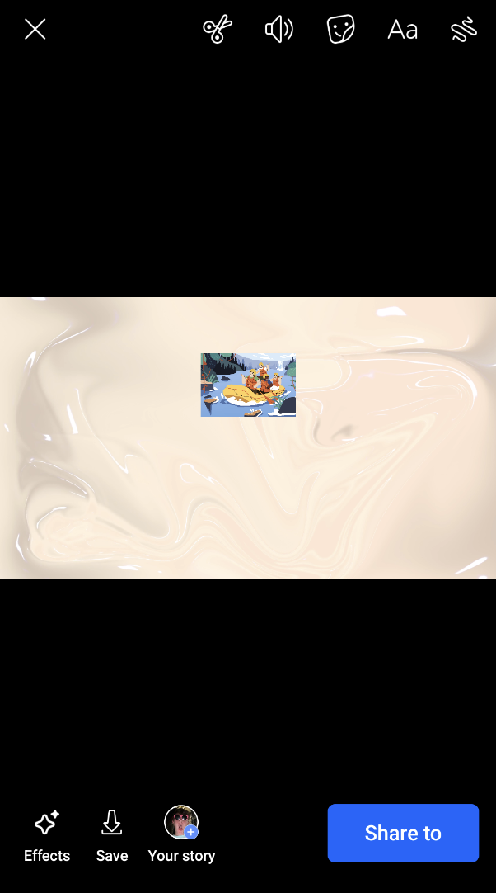

---

### Objava storyja preko intenta

```kt
facebook aplikacijo
val intent = Intent("com.facebook.stories.ADD_TO_STORY")

val appId = getString(R.string.facebook_app_id) // This is your application's FB ID
intent.putExtra("com.facebook.platform.extra.APPLICATION_ID", appId)

val videoAssetUri = FileProvider.getUriForFile(baseContext, "pora.predstavitev.app.provider", getVideoFromRawResource(R.raw.milk, resources, getExternalFilesDir(DIRECTORY_MOVIES)!!)!!)
intent.setDataAndType(videoAssetUri, "video/mp4")

intent.setFlags(Intent.FLAG_GRANT_READ_URI_PERMISSION)

val activity: Activity = this

if (activity.packageManager.resolveActivity(intent, 0) != null) {
    activity.startActivityForResult(intent, 0)
}
```

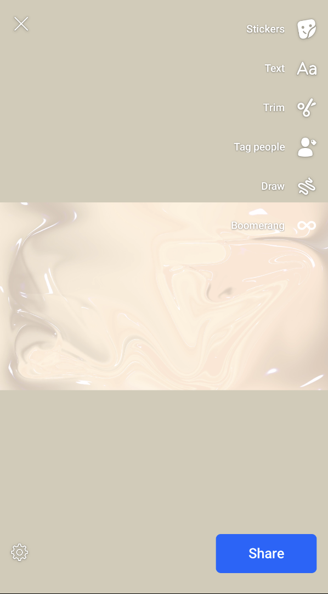

---

### Uporaba Graph APIja

Se uporablja za pridobivanje podatkov o uporabniku, glede na dovoljenja na žetonu za dostopanje.

```kt
val request = GraphRequest.newMeRequest(
    accessToken
) { `object`: JSONObject?, _: GraphResponse? ->
    try {
        val name = `object`!!.getString("name")
        val email = `object`.getString("email")
        val name = `object`!!.getString("id")
        Log.i("GraphRequest", "username: $name, email: $email", id: $id)
    } catch (e: Exception) {
        Log.e("RetrieveLogin", "Error fatching profile data")
        e.printStackTrace()
    }
}

val parameters = Bundle()
parameters.putString("fields", "id,name,email")
request.parameters = parameters
request.executeAsync()
```
